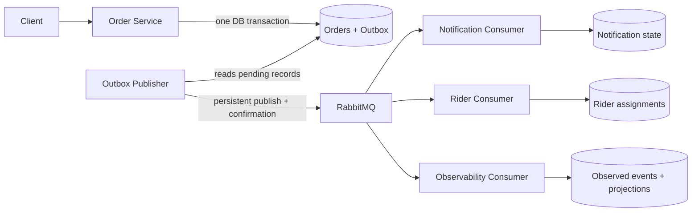

# Mock Messaging: Async Systems Learning Review

  

Date: 27 August 2026

## What this project teaches

This is a strong practical exercise in asynchronous system design. Its value is not that it tries to imitate every part of a production platform; it is that it makes the important failure boundaries visible in a small, working flow.

The main learning outcome is clear:

> An event is not safe merely because it was written to a database or sent to a broker. The design must account for the gap between each durable effect: business state, outbox record, broker publish, consumer effect, and acknowledgement.

The transactional outbox is the centre of that lesson. It replaces an unsafe dual write with a recoverable sequence.

## The system in one view

The canonical diagram is [`SYSTEM_DESIGN.mmd`](SYSTEM_DESIGN.mmd).

The Order Service is authoritative for order state. The other services own their own data and react to order events; they do not share the Order database.

## The most important lesson: why the outbox exists

Without an outbox, placing an order requires two separate actions:

1. Commit the order to the Order database.
2. Publish `order.placed` to RabbitMQ.

Either action can succeed while the other fails. For example, if the order commits and the process dies before publishing, the order exists but downstream services never learn about it. If publishing succeeds and the database transaction later fails, consumers can react to an order that does not exist.

The outbox makes the first boundary atomic:

1. In one Order Service transaction, save the order and an unpublished outbox record.
2. A separate publisher reads pending outbox records.
3. It publishes a persistent message and waits for RabbitMQ confirmation.
4. Only then does it mark the outbox record as published.

If the publisher is down, the event is still durable in the outbox. If it crashes after RabbitMQ accepts the message but before it records `published_at`, the event may be published again. That is acceptable because the system deliberately uses **at-least-once delivery**, not an impossible end-to-end claim of exactly once.

## Failure walkthrough: one order event

| Boundary | Potential failure | What the design demonstrates | Lesson |
| --- | --- | --- | --- |
| Order write | API process stops before commit | Neither order nor outbox event exists | A transaction gives all-or-nothing source state. |
| Order write | Order commits, then the publisher is unavailable | The unpublished outbox record remains | Do not make the client retry carry responsibility for asynchronous delivery. |
| Broker publish | RabbitMQ accepts the message, but the publisher stops before recording `published_at` | The outbox publisher can send it again | Duplicates are a normal consequence of recovery. |
| Consumer effect | A consumer writes its local effect, then stops before acknowledging RabbitMQ | RabbitMQ redelivers the event | Acknowledge only after the durable local effect. |
| Consumer redelivery | The same event arrives twice | `event_id`-based processed-event records and durable delivery identities prevent duplicate effects | Idempotency belongs at the effect boundary. |
| Consumer failure | Email, HTTP, or local handling fails temporarily | Retry queues delay another attempt; a bounded failure goes to a DLQ | Retrying should not block all newer messages indefinitely. |
| Late event | A retry of an earlier event arrives after a newer event | Aggregate versions stop a projection moving backwards | Event ordering is an aggregate concern, not a broker-wide guarantee. |

This is the key mental model to retain: a distributed flow can make each effect safe and recoverable, but it cannot assume every hop happens once or in a single global order.

## What Douglas has demonstrated well

### 1. Choosing the right consistency boundary

The order and its outbox event share one database transaction. That is the right place to demand atomicity because both records belong to the Order Service.

The system does **not** try to make the Order database, RabbitMQ, and every consumer database one transaction. Instead, it accepts independent durable effects and compensates with idempotency and retry behaviour. This is the practical distributed-systems judgement the exercise was intended to build.

### 2. Treating duplicates as normal

The design does not depend on a promise that a message will arrive once. Events have identities, consumers remember processed events, notification deliveries are durable, and the public order-create API uses an idempotency key.

The useful phrase is:

> I assumed a message could be delivered more than once, so I made the side effect safe to repeat.

### 3. Separating authoritative state from derived state

The Order Service owns the order state machine. Notification snapshots and observability projections are useful local representations, not the authority on whether an order is accepted, ready, or assigned.

That distinction makes failure reasoning easier. A projection can be rebuilt; an authoritative business transition must be validated where the business state lives.

### 4. Recognising that a message broker does not solve every failure

RabbitMQ persists and routes messages, but it does not make a consumer's database write atomic with acknowledgement, make HTTP calls unambiguous, or decide which event is newest for an order. The project handles those separate concerns explicitly.

### 5. Using a real example to learn a saga boundary

Rider assignment spans two owners: Rider Service owns the assignment, while Order Service owns the order transition. The assignment identifier makes repeated calls refer to the same decision; the local state can progress from pending to confirmed or completed. That is a small, understandable example of a saga rather than an abstract pattern to memorise.

## Language to practise

When explaining the project, lead with the delivery contract rather than with RabbitMQ features:

> I designed the workflow for at-least-once delivery. The Order Service writes the order and an outbox event atomically. A publisher sends durable messages and waits for broker confirmation. Consumers persist their own idempotency records before acknowledging, so a retry or redelivery does not repeat the business effect. The important lesson for me was separating each failure boundary rather than assuming the broker makes the whole workflow reliable.

If asked why not exactly once:

> Exactly once across an API, database, broker, and independent consumer databases is not a realistic guarantee here. I prefer at-least-once delivery with idempotent effects because I can explain how the system recovers from a process failure at each boundary.

If asked what happens when publishing fails:

> The order is still safe because its outbox record committed with it. The publisher can retry later. The client does not need to know whether RabbitMQ was temporarily unavailable in order for the Order Service to preserve that work.

If asked what happens when a consumer fails after changing its database:

> It has not acknowledged the message yet, so RabbitMQ can redeliver it. The consumer recognises the same event ID and does not repeat its durable effect.

## Questions to ask yourself in future async designs

Use these questions before naming a broker or a database product:

1. What is the authoritative state, and which service owns it?
2. Which state change and event must be atomic together?
3. What does the system do if the process stops after each individual step?
4. Which effects can happen more than once, and what makes them idempotent?
5. Where can events be late or arrive out of order, and which state needs a version?
6. Which actions are local transactions, and which are cross-service workflows that need a saga or reconciliation?
7. What is safe to rebuild because it is derived rather than authoritative?

## A small next practice exercise

Take the same pattern away from food ordering. Design a content-safety decision flow in which a Product Area records a moderation decision and emits an event for downstream enforcement and audit.

Explain only these five moments:

1. The authoritative decision and its outbox record commit together.
2. The publisher can recover if the broker is unavailable.
3. Enforcement and audit consumers are independently idempotent.
4. A failed consumer is retried without losing the source decision.
5. A derived dashboard can be rebuilt, while the authoritative decision remains in its owning service.

That is the transferable system-design skill: start with ownership and failure boundaries, then choose mechanisms such as an outbox, idempotency keys, retries, versions, and a broker to make those boundaries explicit.
